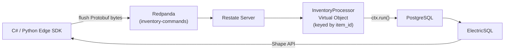

# OpenDDIL HQ — Durable Event Processor

Python backend processor for OpenDDIL — **Restate Virtual Object handlers** that consume events from Redpanda and apply them to PostgreSQL with exactly-once guarantees.

Uses the **official `restate-sdk`** for Python. This demonstrates OpenDDIL's polyglot architecture: C# Edge clients push Protobuf bytes → Redpanda → this Python processor applies them durably to Postgres.

## Architecture



## How It Works

1. **Restate consumes** CloudEvent bytes from the `inventory-commands` Redpanda topic
2. **Routes to `InventoryProcessor`** keyed by `item_id` → sequential processing per item
3. **Deserializes** the CloudEvent envelope → unpacks the `ItemAllocatedEvent` Protobuf
4. **`ctx.run("query_inventory")`** — queries Postgres for current `available_count`
5. **Calculates** new count after deduction
6. **If insufficient stock** → `ctx.run("audit_insufficient")` — compensating action to `audit_log`
7. **If valid** → `ctx.run("apply_allocation")` — `UPDATE inventory_items` + `INSERT audit_log` in one transaction
8. **ElectricSQL** syncs the updated Postgres state back to all Edge nodes

## Key Files

| File | Purpose |
|---|---|
| `src/openddil_hq/inventory_handler.py` | `InventoryProcessor` Virtual Object — `handleItemAllocated` handler |

## Quick Start

```bash
# Install dependencies
pip install restate-sdk asyncpg protobuf hypercorn

# Start the handler service
python -m hypercorn openddil_hq.inventory_handler:app --bind 0.0.0.0:9080

# Register with Restate server
curl -X POST http://localhost:9070/deployments \
  -H 'content-type: application/json' \
  -d '{"uri": "http://host.docker.internal:9080"}'
```

## Dependencies

- `restate-sdk` — Official Restate Python SDK
- `asyncpg` — Async PostgreSQL driver
- `protobuf` — Protobuf deserialization
- `hypercorn` — ASGI server
- Generated classes from `openddil-contracts` (`make python`)

## AI Documentation

| File | Purpose |
|---|---|
| [`llms.txt`](llms.txt) | Structured project summary for LLM discovery |
| [`.cursorrules`](.cursorrules) | Python coding style and Restate conventions |
| [`AGENTS.md`](AGENTS.md) | AI agent safety guidelines |
